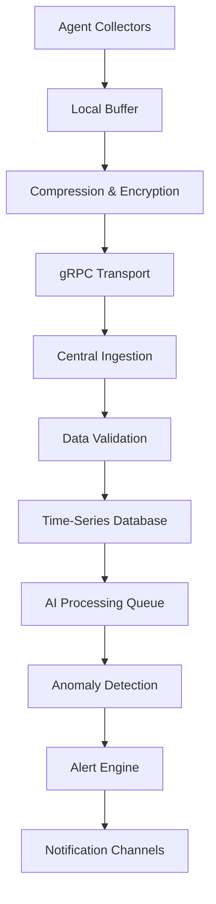

# Sovereign-Node-Watch: Technical Architecture Specification

## Executive Summary

Sovereign-Node-Watch is an AI-driven monitoring solution specifically designed for Hetzner server infrastructure. The system provides intelligent monitoring, anomaly detection, and automated remediation capabilities while maintaining customer data sovereignty and operational simplicity.

**Key Value Propositions:**
- Lightweight agent deployment (< 50MB RAM footprint)
- AI-powered predictive analytics and anomaly detection
- Safe automated remediation actions
- Native Hetzner API integration
- GDPR-compliant data handling for EU market

## 1. System Architecture Overview

### 1.1 High-Level Architecture

The system follows a distributed agent-based architecture with centralized intelligence:

```
┌─────────────────┐    ┌──────────────────┐    ┌─────────────────┐
│   Customer      │    │   Central        │    │   Hetzner       │
│   Servers       │    │   Platform       │    │   APIs          │
│                 │    │                  │    │                 │
│ ┌─────────────┐ │    │ ┌──────────────┐ │    │ ┌─────────────┐ │
│ │ Agent       │◄┼────┼►│ Data Ingress │ │    │ │ Cloud API   │ │
│ │ (Collector) │ │    │ │              │ │    │ │             │ │
│ └─────────────┘ │    │ └──────┬───────┘ │    │ └─────────────┘ │
│                 │    │        │         │    │                 │
│ ┌─────────────┐ │    │ ┌──────▼───────┐ │    │ ┌─────────────┐ │
│ │ Local       │ │    │ │ AI Engine    │ │    │ │ Robot API   │ │
│ │ Actions     │ │    │ │ & Analytics  │ │    │ │             │ │
│ └─────────────┘ │    │ └──────┬───────┘ │    │ └─────────────┘ │
└─────────────────┘    │        │         │    └─────────────────┘
                       │ ┌──────▼───────┐ │
                       │ │ Alert &      │ │
                       │ │ Action       │ │
                       │ │ Engine       │ │
                       │ └──────────────┘ │
                       └──────────────────┘
```

### 1.2 Core Components

#### Agent Layer
- **Monitoring Agent**: Lightweight daemon collecting system metrics
- **Local Remediation Module**: Executes safe automated fixes
- **Communication Module**: Secure data transmission to central platform

#### Central Platform
- **Data Ingestion Service**: Handles metric streams from all agents
- **AI Analytics Engine**: Machine learning for anomaly detection and prediction
- **Alert Management System**: Multi-channel notification distribution
- **Web Dashboard**: Customer-facing monitoring interface
- **API Gateway**: RESTful API for integrations and management

#### Integration Layer
- **Hetzner Cloud API Client**: Server lifecycle management
- **Hetzner Robot API Client**: Dedicated server management
- **Third-party Integrations**: Slack, PagerDuty, email, webhooks

## 2. Key Technical Components

### 2.1 Metrics Collection System

#### Core Metrics
- **System Resources**: CPU usage, memory consumption, disk I/O, network traffic
- **Process Monitoring**: Service health, resource usage per process
- **Custom Metrics**: Application-specific KPIs via plugin system
- **Infrastructure Metrics**: Hardware sensors, RAID status, temperature

#### Collection Architecture
```go
type MetricCollector interface {
    Collect() (*MetricBatch, error)
    Name() string
    Interval() time.Duration
}

type MetricBatch struct {
    ServerID    string              `json:"server_id"`
    Timestamp   time.Time          `json:"timestamp"`
    Metrics     map[string]float64 `json:"metrics"`
    Tags        map[string]string  `json:"tags"`
    ChecksumSHA256 string          `json:"checksum"`
}
```

#### Agent Implementation Details
- **Collection Interval**: 30-second base interval, configurable per metric type
- **Buffer Management**: Local buffering with 24-hour retention for offline scenarios
- **Data Compression**: gRPC with Protocol Buffers for efficient transmission
- **Error Handling**: Exponential backoff with circuit breaker pattern

### 2.2 AI Engine Architecture

#### Anomaly Detection Pipeline
```python
# Simplified AI pipeline architecture
class AnomalyDetectionPipeline:
    def __init__(self):
        self.feature_extractor = TimeSeriesFeatureExtractor()
        self.models = {
            'isolation_forest': IsolationForest(),
            'lstm_autoencoder': LSTMAutoencoder(),
            'statistical': StatisticalAnomalyDetector()
        }
        self.ensemble = EnsembleDetector(self.models)
    
    def process_batch(self, metrics_batch: List[MetricBatch]) -> List[Anomaly]:
        features = self.feature_extractor.extract(metrics_batch)
        anomalies = self.ensemble.detect(features)
        return self.post_process(anomalies)
```

#### ML Model Stack
- **Isolation Forest**: Unsupervised outlier detection for system metrics
- **LSTM Autoencoders**: Sequence modeling for temporal anomaly detection
- **Statistical Models**: Threshold-based detection for known patterns
- **Ensemble Approach**: Weighted voting across multiple detection methods

#### Predictive Analytics
- **Resource Exhaustion Prediction**: 72-hour forecasting for disk, memory, CPU
- **Failure Pattern Recognition**: Historical analysis for proactive maintenance
- **Seasonal Adjustment**: Business cycle awareness for baseline adjustments

### 2.3 Auto-Remediation System

#### Safe Remediation Actions
```yaml
remediation_actions:
  disk_cleanup:
    conditions:
      - disk_usage > 85%
      - free_space < 1GB
    actions:
      - clean_temp_files
      - rotate_logs
      - clear_package_cache
    safety_checks:
      - preserve_user_data: true
      - minimum_free_space: 500MB
      
  service_restart:
    conditions:
      - service_unresponsive > 5min
      - memory_leak_detected: true
    actions:
      - graceful_restart
      - fallback_kill_restart
    safety_checks:
      - max_restart_attempts: 3
      - backoff_period: 10min
```

#### Remediation Framework
- **Action Registry**: Pluggable remediation modules
- **Safety Constraints**: Multi-layer validation before execution
- **Rollback Capability**: Automated rollback for failed remediation attempts
- **Audit Trail**: Complete logging of all automated actions

### 2.4 Hetzner Integration Layer

#### Cloud API Integration
```go
type HetznerCloudClient struct {
    client   *hcloud.Client
    rateLimiter *rate.Limiter
}

func (h *HetznerCloudClient) GetServerMetrics(serverID int) (*ServerInfo, error) {
    server, _, err := h.client.Server.GetByID(context.Background(), serverID)
    if err != nil {
        return nil, err
    }
    
    return &ServerInfo{
        ID:       server.ID,
        Name:     server.Name,
        Status:   string(server.Status),
        PublicIP: server.PublicNet.IPv4.IP.String(),
        Location: server.Datacenter.Location.Name,
    }, nil
}
```

#### Robot API Integration
- **Server Power Management**: Remote power cycling for dedicated servers
- **Rescue System**: Automated rescue boot for recovery operations
- **Hardware Monitoring**: IPMI integration for hardware health metrics
- **Network Configuration**: Automated firewall and routing updates

## 3. Data Flow Architecture

### 3.1 Metric Collection Flow



### 3.2 Real-time Processing Pipeline

#### Message Queue Architecture
- **Primary Queue**: Apache Kafka for high-throughput metric ingestion
- **Processing Queues**: Redis for real-time alert processing
- **Dead Letter Queues**: Error handling and retry mechanisms
- **Partitioning Strategy**: By customer ID for data isolation

#### Stream Processing
```python
# Kafka Streams processing topology
def create_processing_topology():
    builder = StreamsBuilder()
    
    metrics_stream = builder.stream("metrics-topic")
    
    # Real-time anomaly detection
    anomalies = (metrics_stream
                .filter(lambda k, v: v.server_id is not None)
                .group_by_key()
                .window_by(TimeWindows.of(Duration.of_minutes(5)))
                .aggregate(MetricAggregator())
                .map_values(AnomalyDetector()))
    
    # Output to alerts topic
    anomalies.to("alerts-topic")
    
    return builder.build()
```

### 3.3 Data Persistence Strategy

#### Time-Series Data (InfluxDB)
```sql
-- Measurement schema example
CREATE DATABASE sovereign_metrics;

-- Retention policies
CREATE RETENTION POLICY "realtime" ON "sovereign_metrics" 
  DURATION 7d REPLICATION 1 DEFAULT;
  
CREATE RETENTION POLICY "historical" ON "sovereign_metrics" 
  DURATION 365d REPLICATION 1;

-- Example query
SELECT mean("cpu_usage") FROM "system_metrics" 
WHERE "server_id" = 'srv-123' AND time >= now() - 1h 
GROUP BY time(1m);
```

#### Relational Data (PostgreSQL)
- **Customer Management**: Account information, subscription details
- **Server Registry**: Server metadata, configuration settings
- **Alert Configuration**: Rules, thresholds, notification preferences
- **Audit Logs**: Action history, configuration changes

## 4. Deployment Strategy

### 4.1 Agent Installation Methods

#### Automated Installation Script
```bash
#!/bin/bash
# install.sh - One-line installation
set -e

DOWNLOAD_URL="https://releases.sovereign-node-watch.com"
INSTALL_DIR="/opt/sovereign-agent"
SERVICE_NAME="sovereign-agent"

# Detect system architecture
ARCH=$(uname -m)
OS=$(uname -s | tr '[:upper:]' '[:lower:]')

# Download and verify
curl -L "${DOWNLOAD_URL}/latest/${OS}-${ARCH}/sovereign-agent" \
  -o /tmp/sovereign-agent
curl -L "${DOWNLOAD_URL}/latest/${OS}-${ARCH}/sovereign-agent.sha256" \
  -o /tmp/sovereign-agent.sha256

# Verify checksum
cd /tmp && sha256sum -c sovereign-agent.sha256

# Install
sudo mkdir -p ${INSTALL_DIR}
sudo mv /tmp/sovereign-agent ${INSTALL_DIR}/
sudo chmod +x ${INSTALL_DIR}/sovereign-agent

# Create systemd service
sudo tee /etc/systemd/system/${SERVICE_NAME}.service > /dev/null << EOF
[Unit]
Description=Sovereign Node Watch Agent
After=network.target

[Service]
Type=simple
User=sovereign
ExecStart=${INSTALL_DIR}/sovereign-agent
Restart=always
RestartSec=10

[Install]
WantedBy=multi-user.target
EOF

# Enable and start
sudo systemctl daemon-reload
sudo systemctl enable ${SERVICE_NAME}
sudo systemctl start ${SERVICE_NAME}
```

#### Package Manager Distribution
- **DEB packages**: Ubuntu, Debian distribution via APT repository
- **RPM packages**: CentOS, RHEL distribution via YUM repository
- **Snap packages**: Universal Linux package distribution
- **Docker containers**: Containerized deployment option

### 4.2 Update Mechanism

#### Rolling Update Strategy
```go
type UpdateManager struct {
    currentVersion string
    updateChannel  string // stable, beta, alpha
    rollbackStack  []string
}

func (u *UpdateManager) CheckForUpdates() (*UpdateInfo, error) {
    resp, err := http.Get(fmt.Sprintf("%s/updates/%s/%s", 
        updateServerURL, u.updateChannel, u.currentVersion))
    
    if err != nil {
        return nil, err
    }
    
    var updateInfo UpdateInfo
    if err := json.NewDecoder(resp.Body).Decode(&updateInfo); err != nil {
        return nil, err
    }
    
    return &updateInfo, nil
}

func (u *UpdateManager) ApplyUpdate(updateInfo *UpdateInfo) error {
    // Download new binary
    if err := u.downloadBinary(updateInfo.DownloadURL); err != nil {
        return err
    }
    
    // Verify signature
    if err := u.verifySignature(updateInfo.Checksum); err != nil {
        return err
    }
    
    // Backup current version
    u.rollbackStack = append(u.rollbackStack, u.currentVersion)
    
    // Apply update
    return u.switchBinary(updateInfo.Version)
}
```

#### Rollback Procedures
- **Automated Rollback**: Triggered by health check failures post-update
- **Manual Rollback**: Command-line interface for manual intervention
- **Configuration Rollback**: Automatic config versioning and restoration
- **Gradual Rollout**: Canary deployment with automatic rollback triggers

## 5. Security & Compliance

### 5.1 Customer Data Isolation

#### Multi-Tenant Architecture
```yaml
data_isolation_model:
  tenant_separation:
    method: "database_per_tenant"
    encryption: "AES-256-GCM"
    key_management: "customer_managed_keys"
    
  network_isolation:
    vpc_per_tenant: true
    network_policies: strict
    api_rate_limiting: per_customer
    
  access_controls:
    rbac: enabled
    mfa_required: true
    api_key_rotation: 30_days
```

#### Data Processing Boundaries
- **Geographic Data Locality**: EU customer data remains in EU
- **Processing Isolation**: Separate AI model instances per customer segment
- **Audit Trails**: Comprehensive logging of all data access
- **Data Retention**: Configurable retention with automated purging

### 5.2 GDPR Compliance Framework

#### Data Protection Implementation
```python
class GDPRComplianceManager:
    def __init__(self, data_controller, legal_basis):
        self.data_controller = data_controller
        self.legal_basis = legal_basis
        
    def handle_data_subject_request(self, request_type: str, customer_id: str):
        handlers = {
            'access': self.provide_data_access,
            'rectification': self.correct_personal_data,
            'erasure': self.delete_customer_data,
            'portability': self.export_customer_data,
            'restrict_processing': self.restrict_data_processing
        }
        
        return handlers[request_type](customer_id)
        
    def delete_customer_data(self, customer_id: str):
        # Anonymize metrics data
        self.anonymize_time_series_data(customer_id)
        
        # Delete PII
        self.purge_customer_records(customer_id)
        
        # Update audit trail
        self.log_data_deletion(customer_id)
```

#### Privacy by Design Features
- **Data Minimization**: Collect only essential metrics
- **Purpose Limitation**: Use data solely for declared monitoring purposes
- **Storage Limitation**: Automated data lifecycle management
- **Consent Management**: Granular consent for different data processing activities

### 5.3 API Key Management

#### Secure Key Distribution
```go
type APIKeyManager struct {
    keystore   Keystore
    rotator    KeyRotator
    validator  KeyValidator
}

func (m *APIKeyManager) GenerateCustomerKey(customerID string) (*APIKey, error) {
    key := &APIKey{
        ID:         uuid.New().String(),
        CustomerID: customerID,
        Secret:     generateSecureRandom(32),
        CreatedAt:  time.Now(),
        ExpiresAt:  time.Now().Add(30 * 24 * time.Hour),
        Permissions: []string{"metrics:write", "alerts:read"},
    }
    
    // Store encrypted key
    return key, m.keystore.Store(key)
}

func (m *APIKeyManager) ValidateKey(keyID, secret string) (*APIKey, error) {
    key, err := m.keystore.Get(keyID)
    if err != nil {
        return nil, err
    }
    
    if !m.validator.ValidateSecret(key, secret) {
        return nil, ErrInvalidSecret
    }
    
    if key.ExpiresAt.Before(time.Now()) {
        return nil, ErrKeyExpired
    }
    
    return key, nil
}
```

## 6. MVP Technology Stack Recommendations

### 6.1 Programming Languages

#### Agent Development (Go)
**Rationale**: Performance, cross-platform compilation, small binary size
```go
// Example agent main structure
package main

import (
    "context"
    "log"
    "time"
    
    "github.com/sovereign-node-watch/agent/collectors"
    "github.com/sovereign-node-watch/agent/transport"
)

func main() {
    config := loadConfig()
    
    // Initialize collectors
    systemCollector := collectors.NewSystemCollector()
    processCollector := collectors.NewProcessCollector()
    
    // Initialize transport
    client := transport.NewGRPCClient(config.ServerEndpoint)
    
    // Start collection loop
    ticker := time.NewTicker(30 * time.Second)
    for range ticker.C {
        metrics := collectMetrics(systemCollector, processCollector)
        if err := client.SendMetrics(context.Background(), metrics); err != nil {
            log.Printf("Failed to send metrics: %v", err)
        }
    }
}
```

#### Central Platform (Python/FastAPI)
**Rationale**: Rapid development, extensive ML ecosystem, API framework maturity
```python
# FastAPI application structure
from fastapi import FastAPI, Depends
from fastapi.security import HTTPBearer
import uvicorn

app = FastAPI(title="Sovereign Node Watch API")
security = HTTPBearer()

@app.post("/api/v1/metrics")
async def ingest_metrics(
    metrics: MetricsBatch,
    token: str = Depends(security)
):
    # Validate API key
    customer = await validate_api_key(token)
    
    # Store metrics
    await metrics_store.store(customer.id, metrics)
    
    # Queue for AI processing
    await ai_queue.enqueue(metrics)
    
    return {"status": "accepted"}

if __name__ == "__main__":
    uvicorn.run(app, host="0.0.0.0", port=8000)
```

#### AI/ML Components (Python)
**Rationale**: TensorFlow/PyTorch ecosystem, scikit-learn integration
```python
# ML model serving with FastAPI
from fastapi import FastAPI
from tensorflow.keras.models import load_model
import numpy as np

app = FastAPI()
model = load_model('anomaly_detection_model.h5')

@app.post("/predict")
async def predict_anomaly(features: FeatureVector):
    input_array = np.array(features.values).reshape(1, -1)
    prediction = model.predict(input_array)
    
    return {
        "anomaly_score": float(prediction[0]),
        "is_anomaly": prediction[0] > 0.5
    }
```

### 6.2 Database Strategy

#### Time-Series Database (InfluxDB 2.0)
**Configuration**:
```yaml
# influxdb.conf
[http]
  enabled = true
  bind-address = ":8086"
  
[data]
  dir = "/var/lib/influxdb/data"
  wal-dir = "/var/lib/influxdb/wal"
  
[retention]
  enabled = true
  check-interval = "30m"
```

**Rationale**: 
- Native time-series optimization
- Built-in downsampling and retention policies
- High compression ratios for metric data
- SQL-like query language (Flux)

#### Relational Database (PostgreSQL 14+)
**Schema Example**:
```sql
-- Customer management
CREATE TABLE customers (
    id UUID PRIMARY KEY DEFAULT gen_random_uuid(),
    email VARCHAR(255) UNIQUE NOT NULL,
    created_at TIMESTAMP DEFAULT NOW(),
    subscription_tier VARCHAR(50) NOT NULL
);

-- Server registry
CREATE TABLE servers (
    id UUID PRIMARY KEY DEFAULT gen_random_uuid(),
    customer_id UUID REFERENCES customers(id),
    hetzner_server_id VARCHAR(100) NOT NULL,
    hostname VARCHAR(255) NOT NULL,
    last_seen TIMESTAMP DEFAULT NOW(),
    agent_version VARCHAR(50)
);

-- Alert rules
CREATE TABLE alert_rules (
    id UUID PRIMARY KEY DEFAULT gen_random_uuid(),
    customer_id UUID REFERENCES customers(id),
    metric_name VARCHAR(100) NOT NULL,
    condition JSONB NOT NULL,
    severity VARCHAR(20) DEFAULT 'warning'
);
```

### 6.3 Infrastructure Hosting Strategy

#### Containerized Deployment (Kubernetes)
```yaml
# k8s deployment example
apiVersion: apps/v1
kind: Deployment
metadata:
  name: sovereign-api
spec:
  replicas: 3
  selector:
    matchLabels:
      app: sovereign-api
  template:
    metadata:
      labels:
        app: sovereign-api
    spec:
      containers:
      - name: api
        image: sovereign/api:v1.0.0
        ports:
        - containerPort: 8000
        env:
        - name: DATABASE_URL
          valueFrom:
            secretKeyRef:
              name: db-secrets
              key: url
        resources:
          requests:
            memory: "512Mi"
            cpu: "250m"
          limits:
            memory: "1Gi" 
            cpu: "500m"
```

#### Infrastructure Components
- **Ingress**: NGINX Ingress Controller with SSL termination
- **Service Mesh**: Istio for inter-service communication
- **Monitoring**: Prometheus + Grafana for platform monitoring
- **Log Aggregation**: ELK stack for centralized logging
- **CI/CD**: GitLab CI with automated deployment pipelines

### 6.4 Message Queue (Apache Kafka)
```properties
# kafka configuration
num.network.threads=8
num.io.threads=8
socket.send.buffer.bytes=102400
socket.receive.buffer.bytes=102400
socket.request.max.bytes=104857600

# Log settings optimized for metrics data
num.partitions=24
default.replication.factor=3
min.insync.replicas=2

# Retention for metrics topic
log.retention.hours=168  # 7 days
log.segment.bytes=1073741824  # 1GB
log.cleanup.policy=delete
```

## 7. Implementation Roadmap

### Phase 1: MVP Core (Months 1-3)
- Basic agent development and deployment
- Central data ingestion pipeline
- Simple threshold-based alerting
- Basic web dashboard
- Hetzner Cloud API integration

### Phase 2: AI Integration (Months 4-6)
- Anomaly detection model implementation
- Predictive analytics engine
- Auto-remediation framework
- Advanced alerting rules
- Mobile application

### Phase 3: Enterprise Features (Months 7-12)
- Multi-tenant isolation
- GDPR compliance tools
- Advanced integrations (Slack, PagerDuty)
- Custom dashboards and reporting
- Enterprise support features

This architecture provides a solid foundation for building a production-ready monitoring solution that scales with customer needs while maintaining security and compliance requirements.